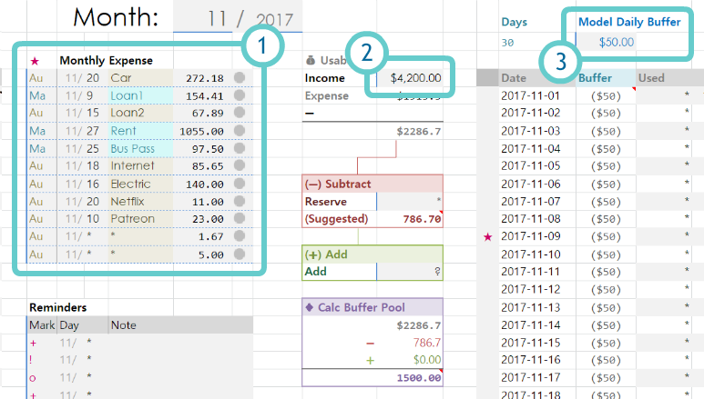
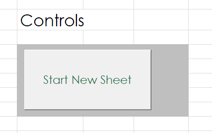
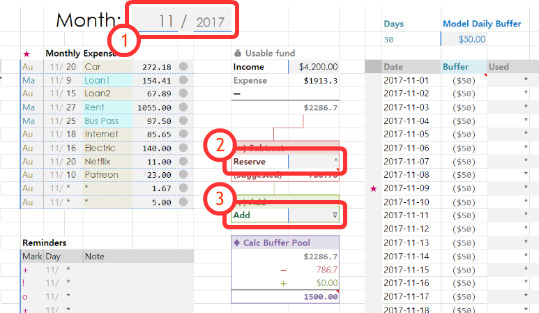

# money-buffer
Money managing sheet. Created to help me more finencially aware each day. 

---
## Initial setup
#### The money buffer sheet will officially become yours after this step

There should be some information will mostly stay the same throghout the year. These information should be entered to `Base` sheet. This way, everytime you start a new monthly sheet, you don't have to enter them again.

1. **Monthly Expense**: Enter your constant monthly bills. 
2. **Monthly Income**: Hopefully this is the same each month. 
3. **Model Buffer**: This is how much daily buffer you would LIKE to have. It's a "model". The money buffer sheet will suggest you the amount of money you can reserve/save based on this number. 

## Start a new month!

Start a new sheet at `_controls` sheet. This button will copy `Base` sheet for you to use.

Fill in the following fields to get your month started.

1. **Fill out month (and year, if you have not done so) on the top.** This populates correct dates into the sheet as well as highlight today's date in the daily chart.
2. **In `Subtract` section,** enter amount you want to subtract from your pool in field `Reserve`. This is the amount of money you promise yourself you will put into your savings account. Reference the amount in `(Suggested)`. That's the amount  you can save and have daily buffer amount of `model buffer` each day. The moment you enter your custom amount in `Reserve`, the money buffer value in `Buffer` column will automatically update.
4. **In `Add` section,** enter amount you want to add to your pool. This can be amount of unused buffer from last month or any extra money you decide to add to the pool (in case your pool is too small this month)

## Recording Daily Expense
#### Probably the most annoying part about the sheet

Record your daily expense into the daily chart, and watch `Total Buffered` go up! (If you are spending less than your daily money buffer).

#### General "workflow"
1. Select the radio button in the row representing the day you spent some money
2. Enter amount you spent on the daily expense chart on the right side. 
3. Click "submit" button.

## Other widgets
There are some small (possibly useless) widgets that you can use to make your chart more friendly for you.

* **Automatic/Manual Bill**: Set value between `Au`(Automatic) or `Ma`(Manual) for each monthly bill to mark which one must be manually handled. If a bill is set to manual, the date which the bill is due will be marked with red star in the daily chart.
* **Bill-Paid Marker**: You can choose between check mark, gray circle, or yellow triagle to mark the status of your bill payment. 
* **Daily Expense Marker**: On the tiny cell on the right of the daily expense cell, select from choice of many icons to make a mark about that day. This is not required and does not effect the buffer. This is just for your own view. 
  * Note: if you wish to make any customization on this cell, see section *Fine Tuning* below.
* **Reminders List**: Use this list to set special custom markers on your daily chart. The date you set will be marked with whatever value in the `Mark` column of this table.
 
## Fine Tuning
* **How to change the list of the icons:** the list of icons are stored in the `Data` sheet. Editing this list will change what icon appears in the dropdown.
* **How to change the number of icons in the list:** to alter the amount of icons in the list, select the dropdown cell, go to `Data > Data Validation`. The reference to the array/vector of icons is set in `Source` field.

---

## Known Issues 

* Known Issue: because money buffer is rounded, sometimes you will automatically will have +/-10 cents auto buffered even if you recorded no expense. 
